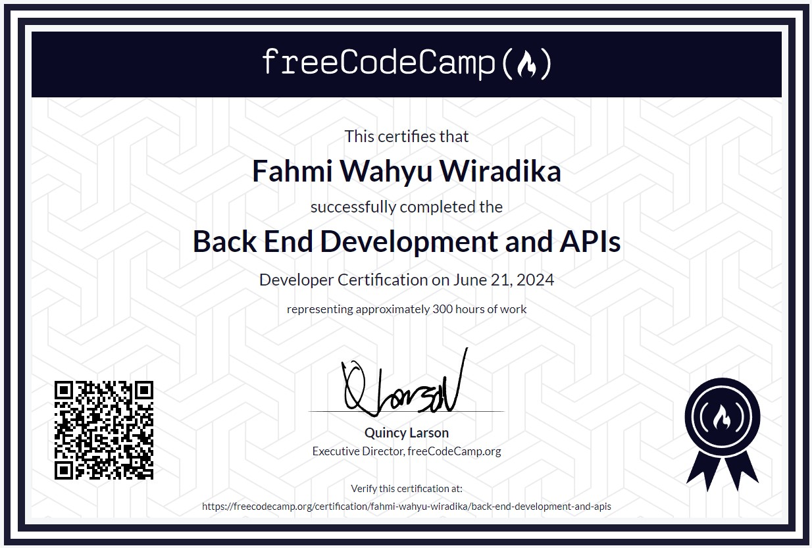
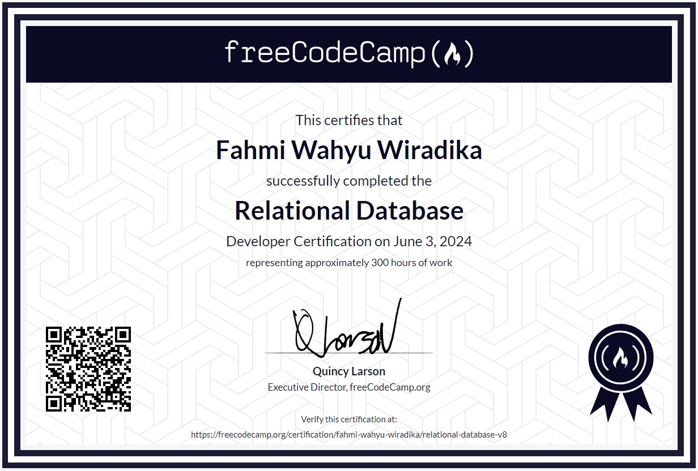
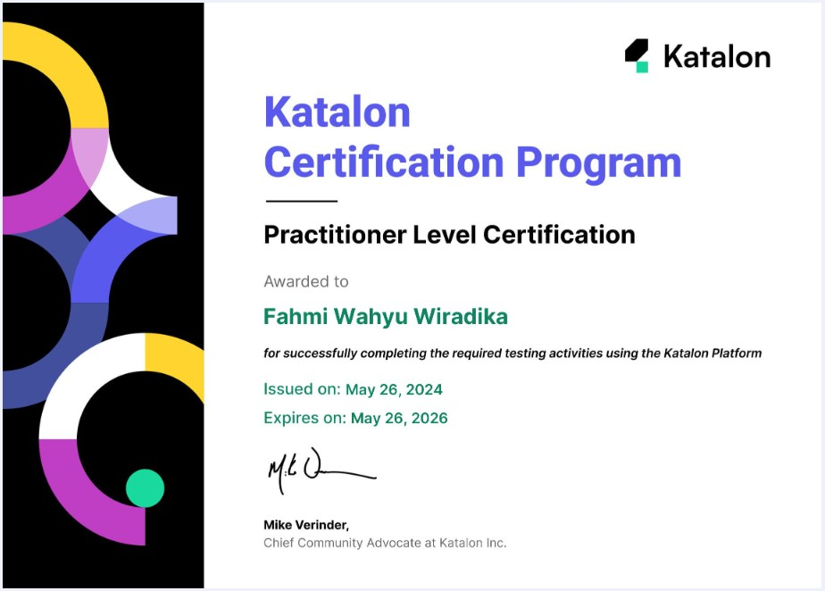
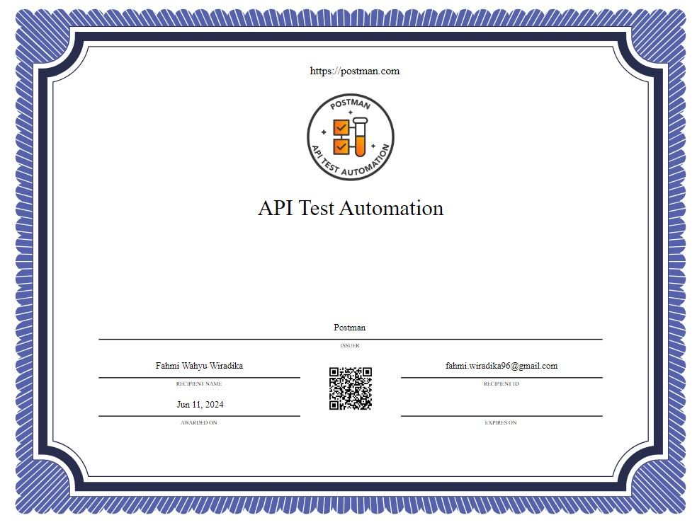

# Certification

## :simple-freecodecamp: freeCodeCamp

freeCodeCamp is a community of people from all around the world who are learning to code together. You will learn to code by building dozens of projects, step-by-step, right in your browser, code editor, or mobile app. You will also earn free verified certifications along the way. Every aspect of freeCodeCamp is 100% free. The courses, the projects, and even the certifications. 

!!! note "Note"
     freeCodeCamp may update Certification Criteria on their curiculum, project material and tool they use to complete the project, make sure keep in touch in their official website on [freeCodeCamp.org](https://www.freecodecamp.org)

### :material-server: Back End Developend and APIs

!!! abstract ""
    !!! note ""
        === "Credentials"
            <figure markdown="span">
            { width="750" }
            <figcaption>freeCodeCamp Relational Database Certificate</figcaption>
            </figure>

            - Credential ID: fahmi-wahyu-wiradika-bedaa
            - Credential URL: [fahmi-wahyu-wiradika/back-end-development-and-apis](https://freecodecamp.org/certification/fahmi-wahyu-wiradika/back-end-development-and-apis)
        === "Source"
            Today, one of the popular ways to build applications is through microservices, which are small, modular applications that work together to form a larger whole.

            In the Back End Development and APIs Certification, you'll learn how to write back end apps with Node.js and npm. You'll also build web applications with the Express framework, and build a People Finder microservice with MongoDB and the Mongoose library.

            follow the link for details about certification materials [freeCodeCamp - Back End Development and APIs](https://www.freecodecamp.org/learn/back-end-development-and-apis/)
        === "Curriculum"
            As part of this certification, Fahmi Wahyu Wiradika built the following projects and got all automated test suites to pass:

            - Timestamp Microservice
            - Request Header Parser Microservice
            - URL Shortener Microservice
            - Exercise Tracker
            - File Metadata Microservice

    ??? tip "Certification Tips" 

        - Create freeCodeCamp user account to track your progress and earn certification
        - Create MongoDB account and clusters for store backend data
        - Learn basic Node.js and Node Package Manager (NPM)
        - Complete 5 project from freeCodeCamp at your pace
        - If you have some issue, internet is your friend, happy coding! :smile:

### :material-database: Relational Database

!!! abstract "" 
    !!! note ""
        === "Credentials"
            <figure markdown="span">
            { width="750" }
            <figcaption>freeCodeCamp Back End Development and APIs Certificate</figcaption>
            </figure>

            - Credential ID: fahmi-wahyu-wiradika-rd
            - Credential URL: [fahmi-wahyu-wiradika/relational-database](https://freecodecamp.org/certification/fahmi-wahyu-wiradika/relational-database-v8)
        === "Source"
            For these courses, you will use real developer tools and software including VS Code, PostgreSQL, and the Linux / Unix command line to complete interactive tutorials and build projects.

            These courses start off with basic Bash commands. Using the terminal, you will learn everything from navigating and manipulating a file system, scripting in Bash, all the way to advanced usage.

            Next, you will learn how to create and use a relational database with PostgreSQL, a database management system, and SQL, the language of these databases.

            Finally, you will learn Git, the version control system, an essential tool of every developer.

            follow the link for details about certification materials [freeCodeCamp - Relational Database](https://www.freecodecamp.org/learn/relational-database/)
        === "Curriculum"
            As part of this certification, Fahmi Wahyu Wiradika built the following projects and got all automated test suites to pass:

            - Celestial Bodies Database
            - World Cup Database
            - Salon Appointment Scheduler
            - Periodic Table Database
            - Number Guessing Game

    ??? tip "Certification Tips" 

        - Create freeCodeCamp user account to track your progress and earn certification
        - Learn how to create, read, update and detele action in PostgreSQL
        - Learn how to create, read, update and delete file in Linux / Unix command line
        - Learn Bash commands and regular expression 
        - Learn Basic Git operation such as branching, rebase, pull, commit, push etc.
        - Complete 5 project from freeCodeCamp at your pace
        - If you have some issue, internet is your friend, happy coding! :smile:

### :octicons-tasklist-16: Quality Assurance

!!! abstract "" 
    !!! note ""
        === "Credentials"
            <figure markdown="span">
            <!-- { width="750" } -->
            <figcaption>
            :material-progress-star:  Certificaiton in progress</figcaption>
            </figure>

            - Credential ID: in progress :material-progress-star:
            - Credential URL: in progress :material-progress-star:
            <!-- [fahmi-wahyu-wiradika/relational-database](https://freecodecamp.org/certification/fahmi-wahyu-wiradika/relational-database-v8) -->
        === "Source"
            As your programs or web applications become more complex, you'll want to test them to make sure that new changes don't break their original functionality.

            In the Quality Assurance Certification, you'll learn how to write tests with Chai to ensure your applications work the way you expect them to.

            Then you'll build a chat application to learn advanced Node and Express concepts. You'll also use Pug as a template engine, Passport for authentication, and Socket.io for real-time communication between the server and connected clients.

            follow the link for details about certification materials [freeCodeCamp - Quality Assurance](https://www.freecodecamp.org/learn/quality-assurance/)
        === "Curriculum"
            As part of this certification, Fahmi Wahyu Wiradika built the following projects and got all automated test suites to pass:

            - Metric-Imperial Converter
            - Issue Tracker
            - Personal Library
            - Sudoku Solver (in progress)
            - American British Translator (in progress)

    ??? tip "Certification Tips" 

        - Create freeCodeCamp user account to track your progress and earn certification
        - Learn Chai package and JavaScript assertions
        - Lear how to write Unit Test and Functional Test in JavaScript with Chai
        - Complete 5 project from freeCodeCamp at your pace
        - If you have some issue, internet is your friend, happy coding! :smile:

## Katalon

Katalon Platform is an automation testing software tool developed by Katalon, Inc. The software is built on top of the open-source automation frameworks Selenium, Appium with a specialized IDE interface for web, API, mobile and desktop application testing. Katalon Certifications are awarded to Katalon users based on completing a set of defined activities using the Katalon Platform. There are three certification types: Practitioner, Professional, and Expert. Each has a set of criteria to meet. The certificates are valid for 2 years.

!!! note "Note"
    1. All criteria can be achieved using either the free or paid version of Katalon solutions.

    2. Katalon may update the qualification criteria from time to time. In such cases, the existing certificates from the previous criteria will still remain valid. 
    
    3. more information on [Katalon Academy Certificaion](https://academy.katalon.com/certifications/)

### Practitioner Level

!!! abstract "" 
    !!! note ""
        === "Credentials"
            <figure markdown="span">
            { width="750" }
            <figcaption>Katalon Practitioner Level Certificate</figcaption>
            </figure>

            - Credential ID: 665334772dd5a
            - Credential URL: [Fahmi - Practitioner Level](https://academy.katalon.com/mcertificate/665334772dd5a)
        === "Source"

            Demonstrates the ability to use Katalon Studio to create, run automated tests, and implement test automation.

            Certification Critetria:

            - Create test cases: 50/50
            - Create test suites: 10/10
            - Create test suite collections: 3/3
            - Run test case/suite/suite collection executions: 75/75

        === "Curriculum"
            Katalon certifies the user for their understanding and hands-on experience of using the Katalon platform for test automation, including:

            - Creating automated test cases using different methods in Katalon Studio
            - Organizing tests in test suites and test suite collections
            - Executing automated tests and viewing reports on Katalon TestOps
            - Scheduling test runs on cloud environments using Katalon TestCloud

    ??? tip "Certification Tips"
        
        - Download free version of [Katalon Studio](https://katalon.com/download)
        - Build Automation Test Project 
        - Join [Katalon Community](https://forum.katalon.com) and [Katalon Certification Program](https://academy.katalon.com/certifications/) for detail of certification criteria 
        - Learn basic and setup for certification material on [Katalon Academy Course](https://academy.katalon.com/courses/?ka-cat=103)
        - Track you Certification Progress at [Katalon Academy Dashboard](https://academy.katalon.com/dashboard/certifications/)
        - Make sure all criteria are completed for certification

### Professional Level

!!! abstract "" 
    !!! note ""
        === "Credentials"
            <figure markdown="span">
            { width="750" }
            <figcaption>Katalon Professional Level Certificate</figcaption>
            </figure>

            - Credential ID: 66548414726aa
            - Credential URL: [Fahmi - Professional Level](https://academy.katalon.com/mcertificate/66548414726aa)
        === "Source"

            Demonstrates the ability to perform efficient automated testing using a combination of Katalon solutions and advanced functionalities

            Certification Critetria:

            -  Run test executions: 150/150
            - Run test suite executions: 10/10
            - Run test suite collection executions: 5/5
            - Run test executions via command lines: 3/3
            - Run test execution in Katalon Studio with Katalon TestCloud Tunnel: 1/1

        === "Curriculum"
            Katalon certifies the user for their solid hands-on experience of using the Katalon platform’s advanced features for test automation, including:

            - Creating a large number of automated test cases using different methods in Katalon Studio
            - Organizing tests in test suites and test suite collections
            - Applying automation to different types of testing
            - Performing visual testing within the Katalon platform
            - Executing a large number of automated tests and viewing reports on Katalon TestOps
            - Running tests on TestOps (local or Docker) using Katalon Runtime Engine

    ??? tip "Certification Tips"
        
        - Create Katalon Account
        - Download Katalon Studio Studio Enterprise (Trial Version for 30 days)
        - Download free version of [Katalon Studio](https://katalon.com/download)
        - Build Automation Test Project 
        - Join [Katalon Community](https://forum.katalon.com) and [Katalon Certification Program](https://academy.katalon.com/certifications/) for detail of certification criteria 
        - Learn basic and setup for certification material on [Katalon Academy Course](https://academy.katalon.com/courses/?ka-cat=103)
        - Track you Certification Progress at [Katalon Academy Dashboard](https://academy.katalon.com/dashboard/certifications/)
        - Make sure all criteria are completed for certification before Katalon Studio Enterprise Expiration Date

### Expert Level

!!! abstract "" 
    !!! note ""
        === "Credentials"
            <figure markdown="span">
            { width="750" }
            <figcaption>Katalon Expert Level Certificate</figcaption>
            </figure>

            - Credential ID: 66572752327b2
            - Credential URL: [Fahmi - Expert Level](https://academy.katalon.com/mcertificate/66572752327b2)
        === "Source"

            Demonstrates the significant ability and extensive experience in using the Katalon Platform for test automation and overseeing testing quality.

            Certification Critetria:

            -  Run test executions locally via Katalon Studio: 30/30
            - Run test executions with Katalon TestCloud environments through Katalon TestOps: 3/3
            - Run test execution in a private domain with Katalon TestCloud Tunnel through Katalon TestOps: 1/1
            - Run test run executions on TestOps agents (Local or Docker) using Katalon Runtime Engine: 3/3
            - Have test execution results in Katalon TestOps: 200/200

        === "Curriculum"
            Katalon certifies the user for their understanding and extensive hands-on experience of using the Katalon platform for test automation, including:

            - Creating a large number of automated test cases using different methods in Katalon Studio
            - Organizing tests in numerous test suites and test suite collections
            - Applying automation to numberous types of testing
            - Executing a large number of automated tests and viewing reports on Katalon TestOps
            - Configuring Katalon TestCloud Tunnel to run tests in private domains on cloud

    ??? tip "Certification Tips"
        
        - Create Katalon Account
        - Download Katalon Studio Studio Enterprise (Trial Version for 30 days)
        - Download free version of [Katalon Studio](https://katalon.com/download)
        - Build Automation Test Project 
        - Join [Katalon Community](https://forum.katalon.com) and [Katalon Certification Program](https://academy.katalon.com/certifications/) for detail of certification criteria 
        - Learn basic and setup for certification material on [Katalon Academy Course](https://academy.katalon.com/courses/?ka-cat=103)
        - Track you Certification Progress at [Katalon Academy Dashboard](https://academy.katalon.com/dashboard/certifications/)
        - Make sure all criteria are completed for certification before Katalon Studio Enterprise Expiration Date

## :simple-postman: Postman
Postman is the world’s leading API platform. Postman's features simplify each step of building an API and streamline collaboration to help create better APIs—faster. More than 30 million developers and 500,000 organizations across the globe use Postman today.

!!! note "Note"
    - Postman may update the qualification criteria from time to time. In such cases, the existing certificates from the previous criteria will still remain valid. 
    - Check [Training Recourses](https://badgr.com/public/issuers/BC0x4AQaQPC7lFilsBP_tQ/badges) by Postman to get certified
    

### API Test Automation

!!! abstract "" 
    !!! note ""
        === "Credentials"
            <figure markdown="span">
            { width="750" }
            <figcaption>Postman API Test Automation Certificate</figcaption>
            </figure>

            - Credential ID: 66681f09fd693638a4001108
            - Credential URL: [Fahmi - API Test Automation](https://badgr.com/public/assertions/Tu5Xrua8S1GHNrEVEXvcgg)
        === "Source"

            For people who are already familiar with creating requests in Postman, this is an introduction to the world of test automation. You will learn how to write tests and automate test executions.

            Certification Critetria:

            - Fork Postman Collection into Personal Workspace
            - Write test script on Pre-Request and Post-Response
            - Complete 5 Assignment Request
            - Claim your Badge

        === "Curriculum"
            The workspace also contains assignments designed to enhance your understanding of API testing with Postman. Upon completion, you'll earn the Postman badge, signifying your proficiency in API test automation.

            - Assignment 1: Verify response status code and the value of the property
            - Assignment 2: Write test case using pm.expect to verify response status code
            - Assignment 3: Write an assertion to verify that the response is in JSON format.
            - Assignment 4: Write a JSON schema and test with an assertion that verifies if the response body matches
            - Assignment 5: Create GitHub project and configure a GitHub Actions workflow for Collection Runner

    ??? tip "Certification Tips" 
        - Watch instruction on [Postman API Test Automation](https://youtu.be/zp5Jh2FIpF0?si=Od5542SHu5lR2pkD) from freeCodeCamp
        - Complete [The Certification Criteria](https://badgr.com/public/badges/bcqkmhE2QM6-8vdjKWlimA) by Postman
        

