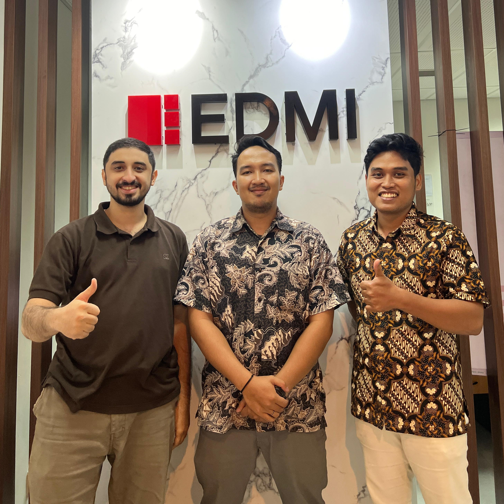
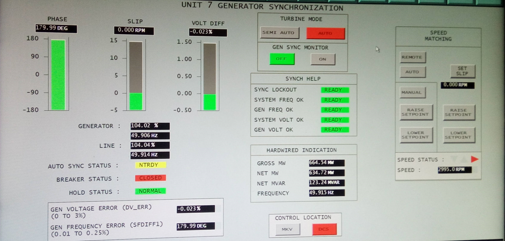

# Career Experience

## Summary 
If you're eager to explore Fahmi's professional career journey in detail, you'll find a comprehensive overview of his diverse and impactful experiences right here.

## Professinoal Career

### Test Engineer  
EDMI Indonesia  <small>(Mar 2020 - Apr 2024) · 4 yrs 2 mos</small>

- Experienced in SDLC models such as Waterfall & Agile
- Contribute to STLC processes such as Test Plan, Test Scenario, Test Case, Test Execution, and Test Closure 
- Hands-on Functional Testing such as System Testing, Retesting, Regression Testing, and Conformance Testing 
- Reproduce known issues from customers and analyze the root cause
- Provide Technical Support for field officers to deliver solutions to customer 
- Write Technical Documentation and User Manual for R&D member
- Develop Automated Testing Tools and Script

??? abstract "Documenation"

    === "Workspace Dashboard"
        <figure markdown="span">
        { width="750" }
        <figcaption>EDMI Indonesia Office Workspace Dashboard</figcaption>
        </figure>
    === "Technical Documentation Web Development"
        <figure markdown="span">
        { width="750" }
        <figcaption>Web based Technical Documentation Development for R&D Team  and Field Officer Technical Support</figcaption>
        </figure>
    === "Code Review"
        <figure markdown="span">
        { width="350" }
        <figcaption>Web based Technical Documentation Development for R&D Team  and Field Officer Technical Support</figcaption>
        </figure>
    === "Software Beta Released"
        <figure markdown="span">
        { width="750" }
        <figcaption>Desktop Application Software Beta Version Released for Internal use of R&D Team</figcaption>
        </figure>
    === "R&D Team"
        <figure markdown="span">
        { width="750" }
        <figcaption>EDMI Indonesia R&D Team</figcaption>
        </figure>
    === "R&D Manager"
        <figure markdown="span">
        { width="400" }
        <figcaption>EDMI Indonesia R&D Manager: Julius Dethan Cornelis Daniel 
        leader and mentor during my jurney with EDMI Indonesia</figcaption>
        </figure>   
    === "Developer Team"
        <figure markdown="span">
        { width="400" }
        <figcaption>Developer Team: Husin Abubakar Alaydrus & Hendra Saktiyasa Partners in Professional and Friends in Personal</figcaption>
        </figure> 

### Scrum Master 
EDMI Indonesia  <small>(Jan 2023 - Jun 2023) · 6 mos</small>

- Responsible for Sprint Ceremonial in Agile Team (sprint planning, spring review, daily stand-up, sprint retrospective, code review and test review)
- Discussed task level of priority with Product Owner 
- Calculated team Story Point weighting
- Reported Team Velocity chart Burndown chart complete and carry over task to RTE
- Discussed team dependencies with RTE
- Delivered sprint goal and objective to stakeholder

??? abstract "Documenation"

    === "Program Increment Planning"
        <figure markdown="span">
        { width="350" }
        <figcaption>PI Planning with EDMI Limited member around the world</figcaption>
        </figure>
    === "Sprint Planning"
        <figure markdown="span">
        { width="350" }
        <figcaption>Planning team objective, dependencies and possible challenge</figcaption>
        </figure>
    === "Confidence Level Voting"
        <figure markdown="span">
        { width="600" }
        <figcaption>Confidence Level Vote for whole duration of Program Increment (3 mos)</figcaption>
        </figure>   
    === "Daily Stand Up"
        <figure markdown="span">
        { width="600" }
        <figcaption>Daily Stand up for update assignment base on progress tracking,  dependencies, and blocker if any</figcaption>
        </figure>
    === "Scrum of Scrum Forum"
        <figure markdown="span">
        { width="600" }
        <figcaption>SOS(Scrum of Scrum) Forum lead by RTE to monitor and improve team peformance</figcaption>
        </figure>
    === "Sprint Review"
        <figure markdown="span">
        { width="600" }
        <figcaption>Sprint Review attended by all R&D Member on site</figcaption>
        </figure>
    
## Internship Program

### Electrical Engineer Intern 
Paiton Operation and Maintenance Indonesia (POMI) <small>(Jan 2018 - Apr 2018) · 4 mos</small>

- Implement Safety Oriented and Safe System Work (SMK3)
- Understand the general design and process of thermal power generation
- Understand engineering drawings and control diagram, P&ID drawing
- Execute unit outages scope of major and critical equipment inspections, repairs and cleaning

??? abstract "Documenation"

    === "Internship Certificate"
        <figure markdown="span">
        { width="650" }
        <figcaption>On Job Training Certificate of Completion</figcaption>
        </figure>
    === "On Job Training Team"
        <figure markdown="span">
        { width="450" }
        <figcaption>Meet the Team from left to right: Bramantyo Ewahyono, Fahmi Wahyu Wiradika,  Hairur Rofiq, Gamar Basuki</figcaption>
        </figure>
    === "Thermal Power Design Concept "
        <figure markdown="span">
        { width="800" }
        <figcaption>Grand Design of Thermal Power Plan Generator</figcaption>
        </figure>
    === "SCADA Overview"
        <figure markdown="span">
        { width="900" }
        <figcaption>Supervisory Control and Data Acquisition - Generator Synchronization Overview</figcaption>
        </figure>
    === "Distributed Control System wiring"
        <figure markdown="span">
        { width="350" }
        <figcaption>DCS(Distributed Control System) Installation and Inspection</figcaption>
        </figure>
    === "BLDC Motor Replacement"
        <figure markdown="span">
        { width="650" }
        <figcaption>Three-Phase Brushless DC Electric Motor Wiring Installation </figcaption>
        </figure>
    === "Brush Generator Maintenance"
        <figure markdown="span">
        { width="600" }
        <figcaption>Brush Generator</figcaption>
        </figure>
        <figure markdown="span">
        { width="300" }
        <figcaption>Brush Generator-Rotor Housing</figcaption>
        </figure>
        <figure markdown="span">
        { width="450" }
        <figcaption>Brush Generator Replacement Process</figcaption>
        </figure>