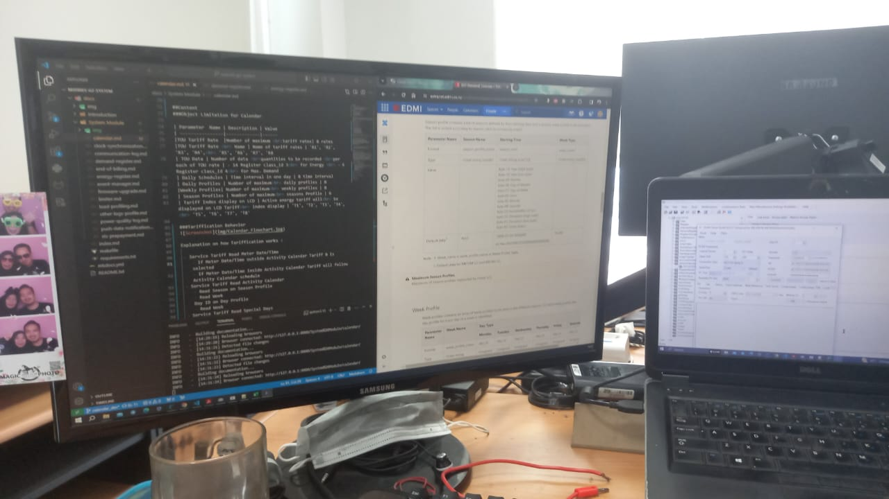
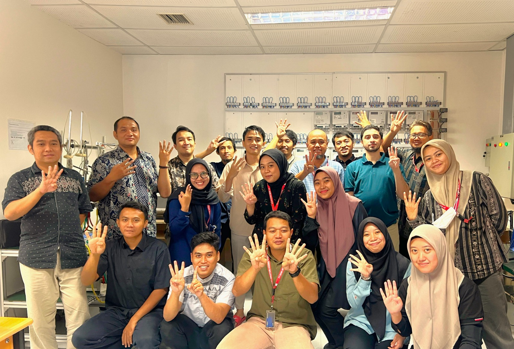
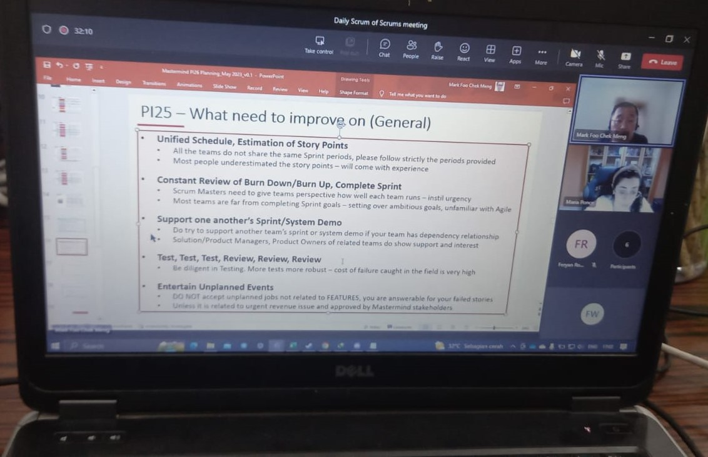

# Experience

## Summary 
If you're eager to explore Fahmi's professional career and education journey in detail, you'll find a comprehensive overview of his diverse and impactful experiences right here.

## Professinoal Career

### Quality Assurance Engineer  
NICPAY Indonesia  <small>(Aug 2020 - now)</small>

- Develop and execute comprehensive test plans, test cases, and test scripts for payment gateway applications.
- Conduct functional, regression, performance, and security testing to identify and resolve issues.
- Collaborate with developers and product development to understand requirements and provide feedback on product design and functionality.
- Automate testing processes to improve efficiency and coverage using industry-standard tools.
- Analyze and document test results, reporting defects and suggesting improvements.
- Maintain testing documentation, including test case design, execution reports, and defect logs.
- Stay up-to-date with industry trends and emerging technologies to enhance testing strategies

??? abstract "Documentation"
    === "Bonding Puncak 2024"
        <figure markdown="span">
        { width="750" }
        <figcaption>Bonding IT Planning & IT Development Department</figcaption>
        </figure>
    === "NICEPAY Cup 2.0"
        <figure markdown="span">
        { width="750" }
        <figcaption>NICEPAY Badminton Cup 2024</figcaption>
        </figure>

### Test Engineer  
EDMI Indonesia  <small>(Mar 2020 - Apr 2024) · 4 yrs 2 mos</small>

- Experienced in SDLC models such as Waterfall & Agile
- Contribute to STLC processes such as Test Plan, Test Scenario, Test Case, Test Execution, and Test Closure 
- Hands-on Functional Testing such as System Testing, Retesting, Regression Testing, and Conformance Testing 
- Reproduce known issues from customers and analyze the root cause
- Provide Technical Support for field officers to deliver solutions to customer 
- Write Technical Documentation and User Manual for R&D member
- Develop Automated Testing Tools and Script

??? abstract "Documentation"
    === "Workspace Dashboard"
        <figure markdown="span">
        { width="750" }
        <figcaption>EDMI Indonesia Office Workspace Dashboard</figcaption>
        </figure>
    === "Technical Documentation Web Development"
        <figure markdown="span">
        { width="750" }
        <figcaption>Web based Technical Documentation Development for R&D Team  and Field Officer Technical Support</figcaption>
        </figure>
    === "Code Review"
        <figure markdown="span">
        { width="350" }
        <figcaption>Web based Technical Documentation Development for R&D Team  and Field Officer Technical Support</figcaption>
        </figure>
    === "Software Beta Released"
        <figure markdown="span">
        { width="750" }
        <figcaption>Desktop Application Software Beta Version Released for Internal use of R&D Team</figcaption>
        </figure>
    === "R&D Team"
        <figure markdown="span">
        { width="750" }
        <figcaption>EDMI Indonesia R&D Team</figcaption>
        </figure>
    === "R&D Manager"
        <figure markdown="span">
        { width="400" }
        <figcaption>EDMI Indonesia R&D Manager: Julius Dethan Cornelis Daniel 
        leader and mentor during my jurney with EDMI Indonesia</figcaption>
        </figure>   
    === "Developer Team"
        <figure markdown="span">
        { width="400" }
        <figcaption>Developer Team: Husin Abubakar Alaydrus & Hendra Saktiyasa Partners in Professional and Friends in Personal</figcaption>
        </figure> 

### Scrum Master 
EDMI Indonesia  <small>(Jan 2023 - Jun 2023) · 6 mos</small>

- Responsible for Sprint Ceremonial in Agile Team (sprint planning, spring review, daily stand-up, sprint retrospective, code review and test review)
- Discussed task level of priority with Product Owner 
- Calculated team Story Point weighting
- Reported Team Velocity chart Burndown chart complete and carry over task to RTE
- Discussed team dependencies with RTE
- Delivered sprint goal and objective to stakeholder

??? abstract "Documentation"
    === "Program Increment Planning"
        <figure markdown="span">
        { width="350" }
        <figcaption>PI Planning with EDMI Limited member around the world</figcaption>
        </figure>
    === "Sprint Planning"
        <figure markdown="span">
        { width="350" }
        <figcaption>Planning team objective, dependencies and possible challenge</figcaption>
        </figure>
    === "Confidence Level Voting"
        <figure markdown="span">
        { width="600" }
        <figcaption>Confidence Level Vote for whole duration of Program Increment (3 mos)</figcaption>
        </figure>   
    === "Daily Stand Up"
        <figure markdown="span">
        { width="600" }
        <figcaption>Daily Stand up for update assignment base on progress tracking,  dependencies, and blocker if any</figcaption>
        </figure>
    === "Scrum of Scrum Forum"
        <figure markdown="span">
        { width="600" }
        <figcaption>SOS(Scrum of Scrum) Forum lead by RTE to monitor and improve team peformance</figcaption>
        </figure>
    === "Sprint Review"
        <figure markdown="span">
        { width="600" }
        <figcaption>Sprint Review attended by all R&D Member on site</figcaption>
        </figure>
    
## Internship Program

### Electrical Engineer Intern 
Paiton Operation and Maintenance Indonesia (POMI) <small>(Jan 2018 - Apr 2018) · 4 mos</small>

- Implement Safety Oriented and Safe System Work (SMK3)
- Understand the general design and process of thermal power generation
- Understand engineering drawings and control diagram, P&ID drawing
- Execute unit outages scope of major and critical equipment inspections, repairs and cleaning

??? abstract "Documentation"
    === "Internship Certificate"
        <figure markdown="span">
        { width="650" }
        <figcaption>On Job Training Certificate of Completion</figcaption>
        </figure>
    === "On Job Training Team"
        <figure markdown="span">
        { width="450" }
        <figcaption>Meet the Team from left to right: Bramantyo Ewahyono, Fahmi Wahyu Wiradika,  Hairur Rofiq, Gamar Basuki</figcaption>
        </figure>
    === "Thermal Power Design Concept "
        <figure markdown="span">
        { width="800" }
        <figcaption>Grand Design of Thermal Power Plan Generator</figcaption>
        </figure>
    === "SCADA Overview"
        <figure markdown="span">
        { width="900" }
        <figcaption>Supervisory Control and Data Acquisition - Generator Synchronization Overview</figcaption>
        </figure>
    === "Distributed Control System wiring"
        <figure markdown="span">
        { width="350" }
        <figcaption>DCS(Distributed Control System) Installation and Inspection</figcaption>
        </figure>
    === "BLDC Motor Replacement"
        <figure markdown="span">
        { width="650" }
        <figcaption>Three-Phase Brushless DC Electric Motor Wiring Installation </figcaption>
        </figure>
    === "Brush Generator Maintenance"
        <figure markdown="span">
        { width="600" }
        <figcaption>Brush Generator</figcaption>
        </figure>
        <figure markdown="span">
        { width="300" }
        <figcaption>Brush Generator-Rotor Housing</figcaption>
        </figure>
        <figure markdown="span">
        { width="450" }
        <figcaption>Brush Generator Replacement Process</figcaption>
        </figure>

## Education

### Bachelor of Applied Industrial Electrical Engineering
Electronic Engineering Polytechnic Institute of Surabaya (EEPIS) <small>(Sept 2015 - Aug 2019) · 3 yrs 11 mos</small>

- Overall GPA 3.35/4.
- Member of Factory Automation Laboratory.
- Member of Industrial Electrical Engineering Student Organization.
- Coursework: Automation Industry, Embedded Systems, Digital Signal Processing.
- Thesis on “Design and build a Smart Energy Meter to identify household loads based on harmonic trace”.

??? abstract "Documentation"
    === "Academic Activity"
        <figure markdown="span">
        { width="500" }
        <figcaption>Factory Automation Laboratory - Siemens S7 300 PLC Module</figcaption>
        </figure>
        <figure markdown="span">
        { width="500" }
        <figcaption>Factory Automation Laboratory - Traffic Light Logic Project</figcaption>
        </figure>
        <figure markdown="span">
        { width="500" }
        <figcaption>Factory Automation Laboratory - Traffic Light Logic Project Demo</figcaption>
        </figure>
    === "Social Activity"
        <figure markdown="span">
        { width="650" }
        <figcaption>Industrial Electrical Engineering Student Organization</figcaption>
        </figure>
        <figure markdown="span">
        { width="650" }
        <figcaption>2015 Industrial Electrical Student Member</figcaption>
        </figure>
        <figure markdown="span">
        { width="650" }
        <figcaption>Industrial Electrical Student Music Club</figcaption>
        </figure>
        <figure markdown="span">
        { width="650" }
        <figcaption>PENS-Rider (EEPIS Motocycle Community)</figcaption>
        </figure>
    === "Final Project Development"
        <figure markdown="span">
        { width="500" }
        <figcaption>Final Project Hardware Scematic Development</figcaption>
        </figure>
        <figure markdown="span">
        { width="500" }
        <figcaption>Final Project Hardware SMD Installation</figcaption>
        </figure>
        <figure markdown="span">
        { width="500" }
        <figcaption>Final Project LCD Testing</figcaption>
        </figure>
        <figure markdown="span">
        { width="500" }
        <figcaption>Finished Hardware Product of Smart Metering System</figcaption>
        </figure>
    === "Final Project Presentation"
        <figure markdown="span">
        { width="500" }
        <figcaption>Smart Metering System Hardware Top View</figcaption>
        </figure>
        <figure markdown="span">
        { width="500" }
        <figcaption>Smart Metering System Hardware Bottom View</figcaption>
        </figure>
        <figure markdown="span">
        { width="500" }
        <figcaption>Smart Metering System Hardware Housing</figcaption>
        </figure>
        <figure markdown="span">
        { width="500" }
        <figcaption>Smart Metering System Demo</figcaption>
        </figure>
