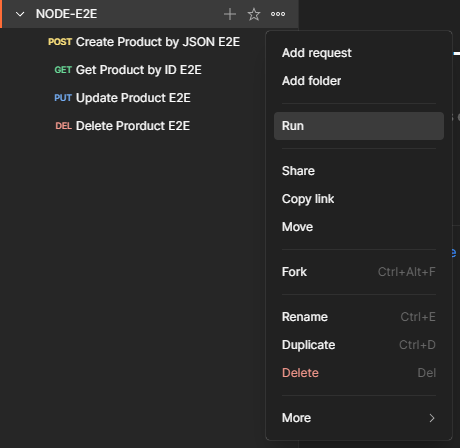

# API Automation Testing Project

A comprehensive API testing automation project using Newman (Postman CLI) with CI/CD integration and performance reporting hosted on GitHub Pages.

## 🚀 Overview

This project provides automated API testing for a Node.js CRUD application with the following features:

- **Local Testing**: Run Newman tests locally using batch scripts
- **CI/CD Integration**: Automated testing on every push to master branch
- **Performance Reporting**: Test results hosted on GitHub Pages
- **Multiple Environments**: Support for development and production environments
- **Comprehensive Test Coverage**: Full CRUD operations testing (Create, Read, Update, Delete)

## 📁 Project Structure

```
├── .github/workflows/
│   └── ci-cd.yml                    # GitHub Actions CI/CD pipeline
├── performance/
│   ├── performance-report.html  # Performance report from Postman GUI 
│   └── performance-report.pdf   # Performance report from POstman GUI 
├── postman/
│   ├── NODE-E2E.postman_collection.json    # Postman test collection
│   ├── dev-env.postman_environment.json    # Development environment
│   └── prod-env.postman_environment.json   # Production environment
├── script/
│   └── collection-runner.bat       # Local Newman runner script
├── reports/                         # Local test reports (gitignored)
└── README.md
```

## 🛠️ Prerequisites

### Local Development
- [Node.js](https://nodejs.org/) (v18 or higher)
- [Newman](https://www.npmjs.com/package/newman) CLI tool
- Newman HTML reporters

### Installation
```bash
# Install Newman globally
npm install -g newman

# Install Newman reporters
npm install -g newman-reporter-html
npm install -g newman-reporter-htmlextra
```

## 🏃‍♂️ Running Tests 

### Using Postman Collection Runner (GUI)

The Postman Collection Runner provides a powerful GUI interface for executing your test collection with detailed performance metrics and HTML report generation.

#### 1. Import Collection and Environment

**Option A: Import Files**

1. Open Postman Desktop or navigate to [Postman Web](https://web.postman.co/)
2. Click **Import** button in the top left
3. Drag and drop or select these files:
    - `postman/NODE-E2E.postman_collection.json`
    - `postman/prod-env.postman_environment.json` (for production)
    - `postman/dev-env.postman_environment.json` (for development)

**Option B: Import via URL** (if hosted on GitHub)

1. Click **Import** → **Link**
2. Paste the raw GitHub URLs for each file

#### 2. Configure Collection Runner

1. Click **Collections** in the sidebar
2. Find your **NODE-E2E** collection

??? abstract "Documentation"
    === "Postman GUI"
        <figure markdown="span">
        { width="500" }
        <figcaption>Collection runner option</figcaption>
        </figure>

3. Click Performance Tab
4. Set up your performance test:

    **Performance Basic Setup:**
    
    - **Load profile**: Select `Fixed`, `Ramp up`, `Spike` or `Peak`
    - **Virtual users**: Set to `5` (or desired number)
    - **Test duration**: Set to `1` (in minutes)
    
    **Performance Metric (Pass test if):**
    
    - **Metric**: Response Time, Error, Requests per second
    - **Condition**: is greater than, is less than, is less than equal to, is greater than equal to
    - **Value**: desired number

??? abstract "Documentation"
    === "Fixed Load"
        <figure markdown="span">
        { width="750" }
        <figcaption>Fixed Load Profile Testing</figcaption>
        </figure>
    === "Ramp Up Load"
        <figure markdown="span">
        { width="750" }
        <figcaption>Ramp Up Load Profile Testing</figcaption>
        </figure>
    === "Spike Load"
        <figure markdown="span">
        { width="750" }
        <figcaption>Spike Load Profile Testing</figcaption>
        </figure>
    === "Peak Load"
        <figure markdown="span">
        { width="750" }
        <figcaption>Peak Load Profile Testing</figcaption>
        </figure>

#### 3. Execute Performance Run

1. Click **Run NODE-E2E** button
2. Monitor real-time execution in the runner interface
3. View detailed request/response data, test results, and timing metrics
4. Watch the progress bar and individual test status

??? abstract "Documentation"
    === "Postman GUI"
        <figure markdown="span">
        { width="750" }
        <figcaption>Performance collection runner test result</figcaption>
        </figure>

#### 4. Download HTML Performance Report

After the collection run completes:

1. **View Results Summary**:

    - Total requests executed
    - Pass/fail test counts
    - Average response time
    - Individual request performance metrics

2. **Export HTML Report**:

    - Click **Export Results** button (top right of runner results)
    - Select **Export as HTML**
    - Choose download location
    - The HTML report includes:
   
        - ✅ Complete test execution summary
        - ✅ Request/response details with timing
        - ✅ Test assertions results
        - ✅ Performance metrics and charts
        - ✅ Environment variables used
        - ✅ Console logs and error details

3. **Report Features**:

    - Interactive charts showing response times
    - Detailed request/response inspection
    - Color-coded test results (pass/fail)
    - Performance trends across iterations
    - Export-friendly format for sharing

#### 5. Performance Analysis

The HTML report provides comprehensive performance insights:

- **Response Time Analysis**: Min/max/average response times per endpoint
- **Throughput Metrics**: Requests per second calculations
- **Error Rate Tracking**: Success/failure ratios
- **Test Coverage**: Assertion results across all test scenarios
- **Timeline View**: Chronological execution flow
- **Performance Trends**: Multi-iteration comparison

### Using Batch Script (Windows)
1. Update the `BASE_DIR` path in `script/collection-runner.bat` to match your project location
2. Run the script:
```cmd
cd script
collection-runner.bat
```

### Using Newman Command Line
```bash
# Run with production environment
newman run postman/NODE-E2E.postman_collection.json \
  --environment postman/prod-env.postman_environment.json \
  --iteration-count 5 \
  --reporters cli,html,json,junit \
  --reporter-html-export reports/newman-report.html \
  --reporter-json-export reports/newman-report.json \
  --reporter-junit-export reports/newman-report.xml \
  --delay-request 1000 \
  --timeout-request 30000

# Run with development environment
newman run postman/NODE-E2E.postman_collection.json \
  --environment postman/dev-env.postman_environment.json \
  --iteration-count 1
```

## 🔄 CI/CD Pipeline

The project includes a comprehensive GitHub Actions workflow (`.github/workflows/ci-cd.yml`) that:

### Test Job
- ✅ Runs Newman tests automatically on push to master
- ✅ Uses production environment configuration
- ✅ Executes 5 iterations with request delays
- ✅ Generates multiple report formats (CLI, JSON, JUnit)
- ✅ Uploads test artifacts for 30 days retention

### Deploy Job
- ✅ Deploys test results to GitHub Pages
- ✅ Creates performance reports dashboard
- ✅ Runs only after test completion
- ✅ Updates on every master branch push

### Workflow Features
- **Concurrent Control**: Cancels previous deployments
- **Error Handling**: Continues pipeline even if tests fail
- **Artifact Management**: Unique naming with run numbers
- **Environment Flexibility**: Easy switching between dev/prod

## 📊 Test Coverage

The E2E test collection covers complete CRUD operations:

### 🆕 Create Product
- **Endpoint**: `POST /api/products`
- **Validation**: Schema validation, field types, MongoDB ObjectId format
- **Environment**: Stores created product ID for subsequent tests

### 📖 Read Product
- **Endpoint**: `GET /api/products/{id}`
- **Validation**: Response structure, data integrity, field validation

### ✏️ Update Product
- **Endpoint**: `PUT /api/products/{id}`
- **Validation**: Updated fields, schema compliance, timestamp validation

### 🗑️ Delete Product
- **Endpoint**: `DELETE /api/products/{id}`
- **Validation**: Deletion confirmation, proper response format

### Test Validations Include:
- JSON Schema validation
- Field type checking (string, integer, ObjectId)
- ISO8601 timestamp format validation
- MongoDB ObjectId pattern matching
- Response key existence verification
- Business logic validation (positive values, non-empty strings)

## 🌐 Environments

### Development Environment
- **Base URL**: `http://localhost:3000`
- **Test Data**: Bakpia (Indonesian traditional food)
- **Use Case**: Local development and testing

### Production Environment
- **Base URL**: `https://simple-crud-apps.vercel.app`
- **Test Data**: Ketoprak (Indonesian traditional food)
- **Use Case**: Production API testing and CI/CD

## 📈 Performance Reporting

### GitHub Pages Integration

Test results are automatically published to GitHub Pages:

- **URL**: `https://[username].github.io/[repository-name]`
- **Content**: Performance reports and test summaries
- **Updates**: Automatic on every master branch push

### Report Types
1. **HTML Reports**: Visual test execution results
2. **JSON Reports**: Machine-readable test data
3. **JUnit Reports**: CI/CD integration compatible
4. **Performance Dashboard**: Hosted on GitHub Pages

## ⚙️ Configuration

### Customizing Test Parameters

Edit the CI/CD workflow parameters in `.github/workflows/ci-cd.yml`:

```yaml
newman run "$COLLECTION" \
  --environment "$ENVIRONMENT" \
  --iteration-count 5        # Number of test iterations
  --timeout-request 30000    # Request timeout (30 seconds)
  --delay-request 1000       # Delay between requests (1 second)
```

### Environment Variables

Update environment files in the `postman/` directory:

- Modify `baseUrl` for different API endpoints
- Adjust test data values (`productName`, `productPrice`, etc.)
- Configure environment-specific settings

### Local Script Configuration

Update paths in `script/collection-runner.bat`:
```batch
set BASE_DIR=C:\Your\Project\Path\
```

## 🔧 Troubleshooting

### Common Issues

1. **Collection/Environment Not Found**
    - Verify file paths in the script
    - Check file names match exactly
    - Ensure files are in the correct directories

2. **Newman Command Not Found**
    - Install Newman globally: `npm install -g newman`
    - Verify Node.js installation
    - Check PATH environment variable

3. **API Connection Issues**
    - Verify API endpoint availability
    - Check network connectivity
    - Validate environment configuration

4. **GitHub Actions Failures**
    - Check workflow logs in Actions tab
    - Verify repository permissions
    - Ensure GitHub Pages is enabled

## 📝 Contributing

1. Fork the repository
2. Create a feature branch
3. Add or modify test cases in the Postman collection
4. Update environment files if needed
5. Test locally using the batch script
6. Submit a pull request

## 📄 License

This project is open source and available under the MIT License.


---

**Happy Testing! 🚀**