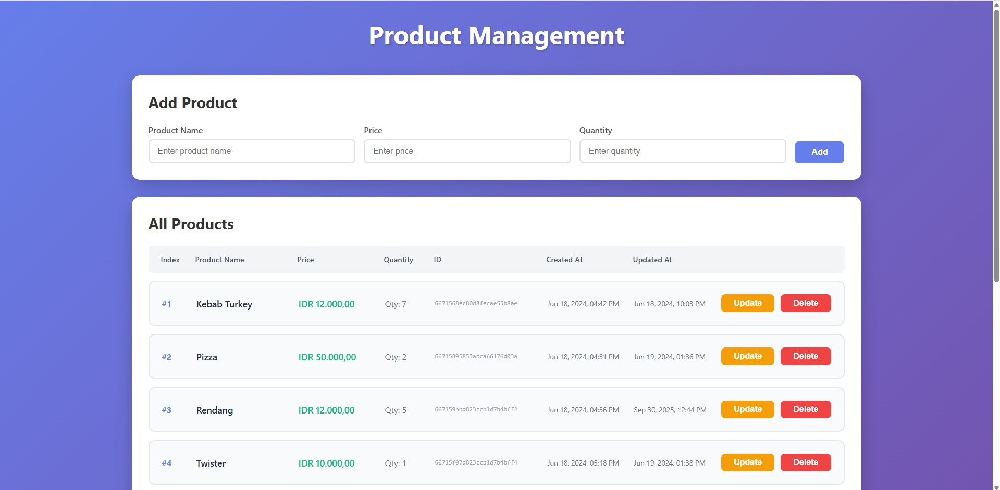
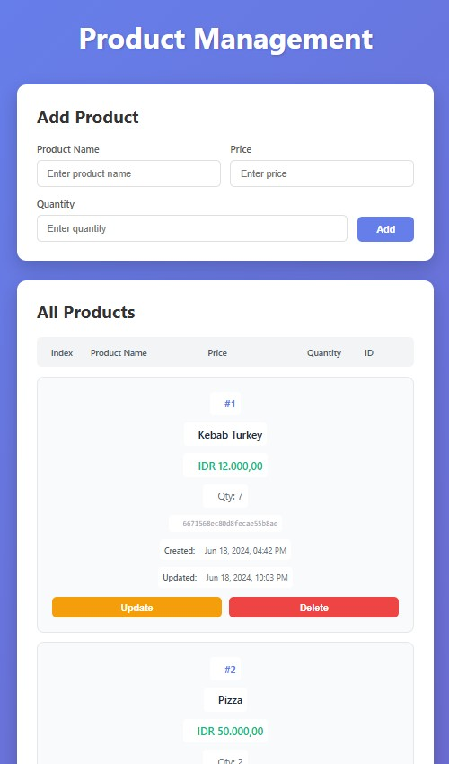

# Simple CRUD Apps - Node.js API with MongoDB

A full-featured Node.js CRUD (Create, Read, Update, Delete) application with MongoDB integration and interactive web frontend, deployed on Vercel. This project demonstrates modern full-stack development with clean REST API architecture and responsive UI.

## 🚀 Overview

This project demonstrates a complete full-stack development workflow:

- **Backend API**: Express.js REST API with MongoDB integration
- **Frontend**: Interactive HTML/CSS/JavaScript interface with real-time updates
- **Database**: MongoDB Atlas cloud database
- **Deployment**: Hosted on Vercel at [https://simple-crud-apps.vercel.app](https://simple-crud-apps.vercel.app)
- **Architecture**: Clean separation of concerns with MVC pattern

## 💡 Inspiration

This project was inspired by the YouTube tutorial: [Build Node.js API from Scratch](https://youtu.be/_7UQPve99r4?si=KfoqN55VkY3Kg59l)

## 🎨 Frontend Features

The application includes a modern, responsive web interface with:

- **Product Management Dashboard**: Add, view, update, and delete products
- **Real-time Updates**: Dynamic product list without page refreshes
- **Responsive Design**: Mobile-first design that works on all devices
- **Interactive Modals**: Smooth modal dialogs for update and delete confirmations
- **Toast Notifications**: User-friendly success and error messages
- **Modern UI**: Gradient backgrounds, smooth animations, and polished styling
- **Auto-formatting**: Currency and date formatting for better readability

### UI Screenshots

The interface features:
- Gradient purple background for visual appeal
- Card-based layout for organized content
- Grid/table view with product details (index, name, price, quantity, ID, timestamps)
- Mobile-responsive design that adapts to different screen sizes
- Action buttons for update and delete operations

!!! abstract "Live App Overview"
    === "Desktop Overview"
        <figure markdown="span">
        { width="800" }
        <figcaption>Simple CRUD Apps Desktop Overview</figcaption>
        </figure>
    === "Mobile Overview"
        <figure markdown="span">
        { width="250" }
        <figcaption>Simple CRUD Apps Mobile Overview</figcaption>
        </figure>

## 🗂️ CRUD Application Structure

### API Endpoints

The application provides a complete REST API for product management:

| Method | Endpoint | Description | Body Required |
|--------|----------|-------------|---------------|
| `GET` | `/api/products` | Get all products | No |
| `GET` | `/api/products/:id` | Get single product | No |
| `POST` | `/api/products` | Create new product | Yes |
| `PUT` | `/api/products/:id` | Update existing product | Yes |
| `DELETE` | `/api/products/:id` | Delete product | No |

### Request/Response Examples

#### Create Product (POST)
```json
// Request Body
{
  "name": "Laptop",
  "quantity": 10,
  "price": 15000000
}

// Response
{
  "_id": "60d5ecb74e33a81234567890",
  "name": "Laptop",
  "quantity": 10,
  "price": 15000000,
  "createdAt": "2023-06-25T10:30:00.000Z",
  "updatedAt": "2023-06-25T10:30:00.000Z",
  "__v": 0
}
```

#### Update Product (PUT)
```json
// Request Body (partial update supported)
{
  "name": "Gaming Laptop",
  "price": 18000000
}

// Response - Updated product with new values
```

#### Delete Product (DELETE)
```json
// Response
{
  "message": "Product deleted successfully"
}
```

## 🗄️ MongoDB Integration

### Database Configuration
- **Provider**: MongoDB Atlas (Cloud)
- **Connection**: Mongoose ODM
- **Environment Variables**:
    - `SCA_DB_NAME`: Database username
    - `SCA_DB_PASSWORD`: Database password

### Product Schema
```javascript
{
  name: {
    type: String,
    required: [true, "Please enter product name"]
  },
  quantity: {
    type: Number,
    required: true,
    default: 0 
  },
  price: {
    type: Number,
    required: true,
    default: 0 
  },
  Image: {
    type: String,
    required: false
  }
}
```

### Features
- **Timestamps**: Automatic `createdAt` and `updatedAt` fields
- **Validation**: Required field validation with custom messages
- **MongoDB ObjectId**: Automatic ID generation and validation
- **Flexible Updates**: Support for partial updates (only specified fields)

## 🌐 Deployment on Vercel

### Live Application
- **URL**: [https://simple-crud-apps.vercel.app](https://simple-crud-apps.vercel.app)
- **Status**: Production ready
- **Environment**: Node.js runtime on Vercel

### Vercel Configuration

The project uses a custom `vercel.json` configuration for optimal routing:

```json
{
  "version": 2,
  "builds": [
    {
      "src": "index.js",
      "use": "@vercel/node"
    }
  ],
  "routes": [
    {
      "src": "/api/(.*)",
      "dest": "index.js"
    },
    {
      "src": "/(.*)",
      "dest": "/public/$1"
    }
  ]
}
```

**Key Features:**
- API routes (`/api/*`) are handled by the Express server
- Static files are served from the `public` directory
- Frontend and backend integrated in a single deployment
- Automatic HTTPS and global CDN distribution

### Deployment Features
- **Automatic Deployment**: Triggered by GitHub pushes
- **Environment Variables**: Securely stored MongoDB credentials
- **Serverless Functions**: Scalable serverless architecture
- **Global CDN**: Fast worldwide access for static assets
- **Zero Configuration**: Works out of the box with the included config

## 🏃‍♂️ Running the Project Locally

### Prerequisites
- [Node.js](https://nodejs.org/) (v16 or higher)
- [MongoDB Atlas](https://www.mongodb.com/cloud/atlas) account
- [Git](https://git-scm.com/) for cloning

### Installation Steps

1. **Clone the Repository**
```bash
git clone https://github.com/yourusername/simple-crud-apps.git
cd simple-crud-apps
```

2. **Install Dependencies**
```bash
npm install
```

3. **Setup Environment Variables**
   Create a `.env` file in the root directory:
```env
SCA_DB_NAME=your_mongodb_username
SCA_DB_PASSWORD=your_mongodb_password
```

4. **Start Development Server**
```bash
# Development mode with nodemon (auto-reload)
npm run dev

# Production mode
npm run serve
```

5. **Access the Application**
- **Web Interface**: `http://localhost:3000`
- **API Base**: `http://localhost:3000/api/products`

### Project Structure
```
├── controllers/
│   └── product.controller.js    # Business logic for CRUD operations
├── models/
│   └── product.models.js        # Mongoose schema definition
├── routes/
│   └── product.route.js         # API route definitions
├── public/
│   └── index.html              # Frontend web interface
├── index.js                     # Application entry point
├── vercel.json                  # Vercel deployment configuration
├── package.json                 # Dependencies and scripts
└── README.md
```

## 🧪 API Testing

For comprehensive API testing and automation, check out the dedicated testing repository:

- **GitHub Repository**: [https://github.com/fahmiwazu/newman-automation](https://github.com/fahmiwazu/newman-automation)
- **Live Test Results**: [https://fahmiwazu.github.io/newman-automation](https://fahmiwazu.github.io/newman-automation)

The testing repository includes:
- Automated Newman/Postman test collections
- CI/CD pipeline with GitHub Actions
- Performance reporting and monitoring
- Both local and production environment testing

## 🛠️ Development Scripts

```json
{
  "scripts": {
    "dev": "nodemon index.js",      // Development with auto-reload
    "serve": "node index.js",       // Production server
    "test": "echo \"Error: no test specified\" && exit 1"
  }
}
```

## 🧰 Tech Stack

### Backend
- **Runtime**: Node.js
- **Framework**: Express.js v4.19.2
- **Database**: MongoDB with Mongoose ODM v8.4.3
- **Environment**: dotenv v17.2.2 for configuration

### Frontend
- **HTML5**: Semantic markup
- **CSS3**: Modern styling with flexbox and grid
- **Vanilla JavaScript**: Fetch API for HTTP requests
- **Responsive Design**: Mobile-first approach

### Deployment
- **Platform**: Vercel with serverless functions
- **Database**: MongoDB Atlas
- **Domain**: Custom Vercel domain with HTTPS

## 🔧 Troubleshooting

### Common Issues

1. **Database Connection Failed**
    - Verify MongoDB Atlas credentials in `.env` file
    - Check IP whitelist in MongoDB Atlas (allow `0.0.0.0/0` for Vercel)
    - Ensure environment variables are set correctly in Vercel dashboard

2. **Local Server Won't Start**
    - Check if port 3000 is available: `lsof -i :3000` (Mac/Linux) or `netstat -ano | findstr :3000` (Windows)
    - Verify Node.js installation: `node --version`
    - Install dependencies with `npm install`

3. **Environment Variables Not Loading**
    - Create `.env` file in root directory
    - Check `.env` file syntax (no quotes needed)
    - Restart server after adding variables
    - For Vercel: Add environment variables in project settings

4. **Frontend Not Loading on Vercel**
    - Verify `vercel.json` routing configuration
    - Check that `public` directory contains `index.html`
    - Review Vercel deployment logs for errors

5. **API Returns 404 on Vercel**
    - Ensure API routes use `/api` prefix
    - Verify `vercel.json` routes configuration
    - Check that `index.js` is properly exporting the Express app

## 📊 API Usage Examples

### Using cURL

```bash
# Get all products
curl -X GET https://simple-crud-apps.vercel.app/api/products

# Create a product  
curl -X POST https://simple-crud-apps.vercel.app/api/products \
  -H "Content-Type: application/json" \
  -d '{"name":"Smartphone","quantity":5,"price":8000000}'

# Get single product
curl -X GET https://simple-crud-apps.vercel.app/api/products/{product_id}

# Update product (partial update)
curl -X PUT https://simple-crud-apps.vercel.app/api/products/{product_id} \
  -H "Content-Type: application/json" \
  -d '{"name":"iPhone","price":12000000}'

# Delete product
curl -X DELETE https://simple-crud-apps.vercel.app/api/products/{product_id}
```

### Using JavaScript (Fetch API)

```javascript
// Get all products
const response = await fetch('https://simple-crud-apps.vercel.app/api/products');
const products = await response.json();

// Create new product
const newProduct = await fetch('https://simple-crud-apps.vercel.app/api/products', {
  method: 'POST',
  headers: { 'Content-Type': 'application/json' },
  body: JSON.stringify({
    name: 'Tablet',
    quantity: 3,
    price: 5000000
  })
});

// Update product
const updateProduct = await fetch(`https://simple-crud-apps.vercel.app/api/products/${id}`, {
  method: 'PUT',
  headers: { 'Content-Type': 'application/json' },
  body: JSON.stringify({
    price: 6000000  // Partial update
  })
});

// Delete product
const deleteProduct = await fetch(`https://simple-crud-apps.vercel.app/api/products/${id}`, {
  method: 'DELETE'
});
```

### Using the Web Interface

Simply visit [https://simple-crud-apps.vercel.app](https://simple-crud-apps.vercel.app) to:
- View all products in a beautiful table layout
- Add new products using the form at the top
- Update products by clicking the "Update" button
- Delete products with confirmation modal
- See real-time updates without page refresh

## 🎯 Key Features

### Backend Features
- ✅ RESTful API design
- ✅ MongoDB integration with Mongoose
- ✅ Error handling and validation
- ✅ Environment-based configuration
- ✅ Serverless deployment ready
- ✅ Automatic timestamps
- ✅ Partial update support

### Frontend Features
- ✅ Responsive mobile-first design
- ✅ Real-time product management
- ✅ Modal dialogs for user interactions
- ✅ Toast notifications for feedback
- ✅ Currency and date formatting
- ✅ Empty state handling
- ✅ Loading states
- ✅ Error handling
- ✅ Clean and modern UI

## 🤝 Contributing

1. Fork the repository
2. Create a feature branch (`git checkout -b feature/amazing-feature`)
3. Commit your changes (`git commit -m 'Add some amazing feature'`)
4. Push to the branch (`git push origin feature/amazing-feature`)
5. Open a Pull Request

## 📄 License

This project is open source and available under the MIT License

## 🔗 Quick Links

- **Live Application**: [https://simple-crud-apps.vercel.app](https://simple-crud-apps.vercel.app)
- **API Testing Repository**: [https://github.com/fahmiwazu/newman-automation](https://github.com/fahmiwazu/newman-automation)
- **Live Test Results**: [https://fahmiwazu.github.io/newman-automation](https://fahmiwazu.github.io/newman-automation)
- **YouTube Tutorial**: [Build Node.js API from Scratch](https://youtu.be/_7UQPve99r4?si=KfoqN55VkY3Kg59l)
- **MongoDB Atlas**: [https://www.mongodb.com/cloud/atlas](https://www.mongodb.com/cloud/atlas)
- **Vercel**: [https://vercel.com](https://vercel.com)

## 📝 Notes

- The frontend uses vanilla JavaScript (no framework) for simplicity and performance
- The application demonstrates both API and full-stack capabilities
- Vercel configuration enables both backend API and frontend hosting in one deployment
- MongoDB connection strings use the Atlas cluster for reliable cloud hosting
- The application supports both local development and production deployment seamlessly

---

**Happy Coding! 🚀**